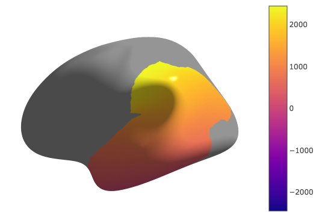

[](https://github.com/miykael/parcellation_fragmenter/issues/)
[](https://github.com/miykael/parcellation_fragmenter/pulls/)
[](https://GitHub.com/miykael/parcellation_fragmenter/graphs/contributors/)
[](https://github.com/miykael/parcellation_fragmenter/commits/master)
[](https://github.com/miykael/parcellation_fragmenter/archive/master.zip)
[](http://hits.dwyl.io/miykael/parcellation_fragmenter)


# Parcellation Fragmenter

Fragments FreeSurfer parcellation annotation in N-equal sized parcels. Besides looking beautiful, such surface parcellation could be used as feature extract for machine learning approaches or similar.

The current version takes either the whole FreeSurfer surface and devides it into N equal sized parcels or it takes a predefined region of interest (ROI), specified by FreeSurfer's `aparc.annot` file and fragments this region in N equal sized parcels.

The parcellation can be done by using a Gaussian Mixed Model, a Ward or a K-Means approach.

The following figure shows an example of a whole surface fragmentation for 16, 64, 256, 1024, 4096 parcels using a Gaussian Mixed Models approach:


The following figure shows an example of a fragmentation of the superior temporal cortex for 4, 16, 64, 256, 1024 using a K-Means approach:


# How to install it

```bash
git clone https://github.com/miykael/parcellation_fragmenter.git
cd ./parcellation_fragmenter
pip install -e .
```


# How to run it

**Note: For a detailed walk-through of how to use the code, see ./notebooks/Demo.ipynb.**

```python
import nibabel as nb # for loading surfaces
from fragmenter import RegionExtractor # for extracting regional indices
from fragmenter import Fragment # main fragmentation class
from fragmenter import colormaps # for generating new colormaps

# Define surface file and annotation file.
# If you are using Gifti-structured data, use ```nb.load()``` instead,
# the vertices and faces will exists as GiftiDataArrays objects
verts, faces = nb.freesurfer.io.read_geometry(
  '../data/hcp/L.sphere.32k_fs_LR.surf.gii')

# Extract region-specific indices
# Likewise, you can also specific an HCP-styped Gifti Label object
# with extension .label.gii.
E = RegionExtractor.Extractor(
  '../data/freesurfer/fsaverage/label/lh.aparc.annot')
parcels = E.map_regions()

# Define set of regions of interest.  These region names are dependent
# on the region IDs in the original annotation / label file.
rois=['temporalpole','inferiortemporal','middletemporal',
  'superiortemporal', 'transversetemporal','bankssts',
      'inferiorparietal','supramarginal']
```

```python
# Instantiate the fragmentation object and generate the sub-regions.
temporal = Fragment.Fragment(n_clusters=75)
temporal.fit(vertices=verts, faces=faces,
  parcels=parcel_maps, rois=rois, size=15)

# If you want to generate pretty color-scheme with a gradient along the
# inferior-superior axis, do the following:
[_, ctab, names, remapped] = colormaps.get_ctab_and_names(verts,
  temporal.label_)
plotting.view_surf([verts, faces],
  remapped, threshold=0.1, cmap='plasma')
```



```python
# We can then save the map with:
annot_name = '../data/freesurfer/fsaverage/label/lh.temporal.annot'
F.write(annot_name)

```

# How to help with it

There are still many things that can be changed/adapted/added. So please feel free to check-out the [issues section](https://github.com/miykael/parcellation_fragmenter/issues) for what can be done, fork the project, send me a PR or give us a feedback!

# License

This project is licensed under BSD 3-Clause License.
