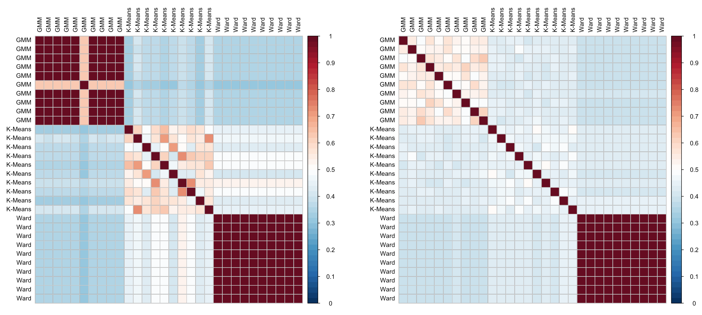
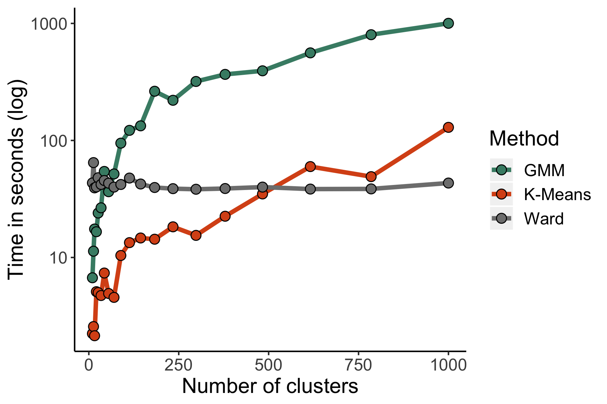

# Summary

Fmri is a useful way to probe brain function, but analytically there are many degrees of freedom that make its analysis cumbersome. One of these is determining what a unit of function is, which affects power (voxel). Parcellations offer a great remedy to this problem, including improving signal power (glasser, power 2011). However, there is ongoing debate as to what constitutes the human functional brain parcellation (glasser, DSK from fs, brodmann, etc), and recent individualized investigations show high functional topographic heterogeneity in association cortex that varies across regions (braga, gordon, muller, gratton, fedorenko, toro-serey). And it's been stipulated that there is no single functional parcellation to begin with (constable). Furthermore, averaging functional signals over large regions of cortex can introduce unwelcomed autocorrelation (nichols neuroimage). These issues undermine the complete reliance on functional rois as units of analysis, eapeciallyfor connectivity. (Also add how careless roi definitions can inflate correlation estimates, Vul 2009).

An alternative to relying on a specific map is to define n equidistant rois (craddock?). For example, one can downsample a region with 1000 voxels into 10 equally sized regions. This can potentially increase statistical power without introducing bias. Here we introduce a simple Python tool that allows the user to segregate the cortical mantle, or subregions within it, into any number of equally sized subregions based on a subjects surface structure.

(Michael: Perhaps also mention that it reduces computational demand as it can be used as a dimensionality reduction tool. Also, something like this could also be used to create "searchlight" regions for an MVPA analysis)

(Michael: The following images should be integrated into the text as well.)

# Acknowledgement

This project was started at Neurohackademy 2018 which is funded by the National Institute of Mental Health through a grant to Ariel Rokem and Tal Yarkoni (R25MH112480).

# References